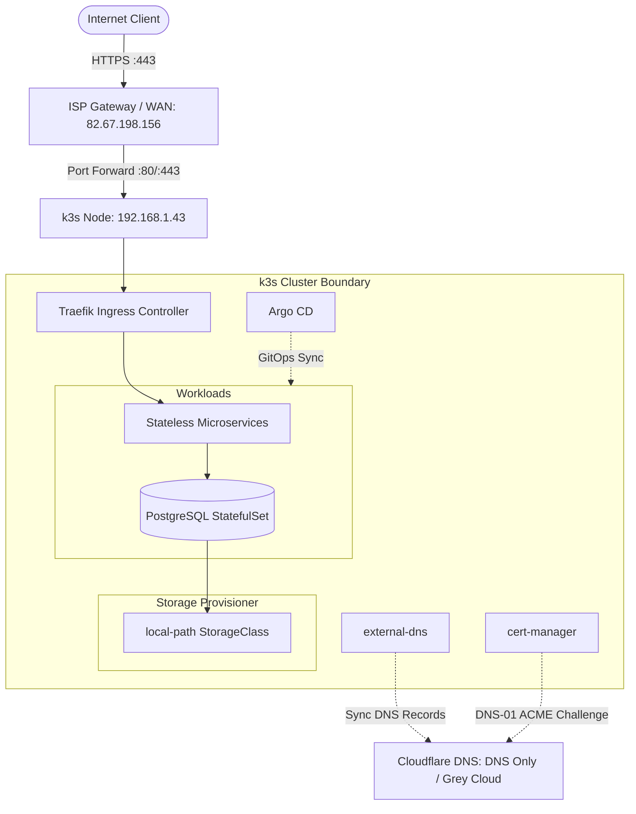

# Homelab k3s GitOps Infrastructure

Declarative GitOps infrastructure and bootstrap repository for a single-node **k3s** Kubernetes cluster hosted on Proxmox VE.

The cluster manages continuous deployments via **Argo CD**, handles dynamic ingress via **Traefik**, automates DNS records on **Cloudflare** using **external-dns**, provisions TLS certificates via **cert-manager** (Let's Encrypt DNS-01), and securely tracks encrypted secrets in version control using Bitnami **Sealed Secrets**.

---

## Technical Documentation

The complete architectural documentation, onboarding runbooks, and manifest references are compiled with **MkDocs Material** and hosted on GitHub Pages:

**Documentation Website:** [https://zipleix.github.io/homelab-infra/](https://zipleix.github.io/homelab-infra/)

---

## Architecture Overview



---

## Core Operational Rules

1. **GitOps Invariant:** Workloads must not be manually modified via `kubectl apply`. All deployments are managed through Argo CD tracking Git repositories.
2. **DNS Only (Grey Cloud):** Ingress hostnames (`*.baptiste.zip`) must be configured as **DNS Only (Grey Cloud)** in Cloudflare. Proxied mode (Orange Cloud) prevents Traefik end-to-end TLS negotiation.
3. **Sealed Secrets Only:** No plaintext Kubernetes `Secret` resources are ever committed. All secrets must be encrypted locally using `kubeseal` before committing.
4. **Isolated Databases:** StatefulSet databases must never define an `Ingress` and are accessible exclusively over the private cluster network.

---

## Repository Structure

```text
homelab-infra/
├── .github/
│   └── workflows/
│       └── documentation.yml   # Deploys MkDocs site to GitHub Pages
├── docs/                       # MkDocs documentation source files
│   ├── architecture/           # Networking, DNS/TLS, GitOps specs
│   ├── guides/                 # Secrets encryption, service onboarding, DB
│   └── manifests/              # Production YAML manifest templates
├── manifests/                  # Core cluster add-ons and apps
│   ├── 00-sealed-secrets/      # Sealed Secrets controller manifests
│   ├── 01-external-dns/        # ExternalDNS deployment & Cloudflare provider
│   ├── 02-cert-manager/        # Cert-manager & letsencrypt-prod ClusterIssuer
│   └── apps/                   # Declarative Argo CD Application manifests
└── mkdocs.yml                  # MkDocs configuration and navigation structure
```

---

## Quick Reference: Sealing a Secret

```bash
kubectl create secret generic my-app-secrets \
  --namespace default \
  --from-literal=DB_PASSWORD="secure-password" \
  --dry-run=client -o yaml | \
  kubeseal --controller-name=sealed-secrets --controller-namespace=kube-system --format=yaml > k8s/sealed-secret.yaml
```

---

## Starter Templates

Boilerplate repositories pre-configured with multi-stage Docker builds, GitHub Actions CI targeting GHCR, and `k8s/` manifests:

* **Backend Service (Go):** [`ZiplEix/template-go-service`](https://github.com/ZiplEix/template-go-service)
* **Frontend App (SvelteKit / Bun):** [`ZiplEix/template-sveltekit-app`](https://github.com/ZiplEix/template-sveltekit-app)
