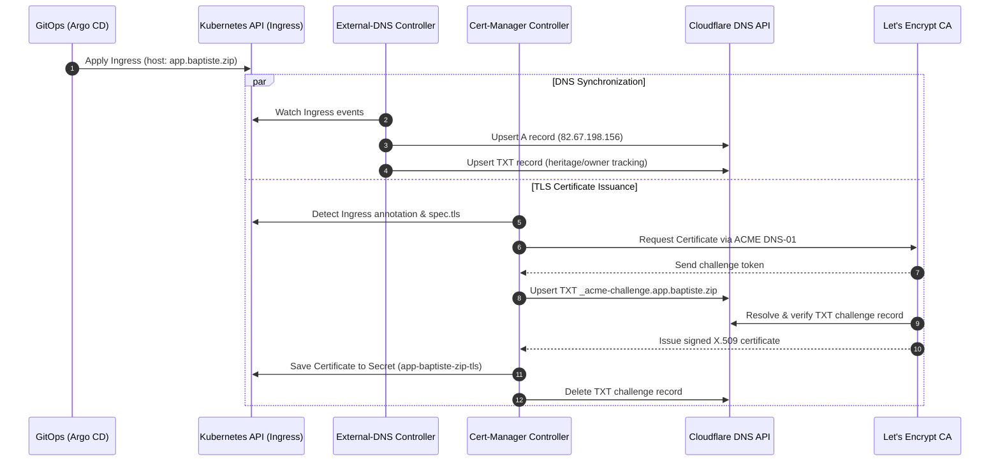
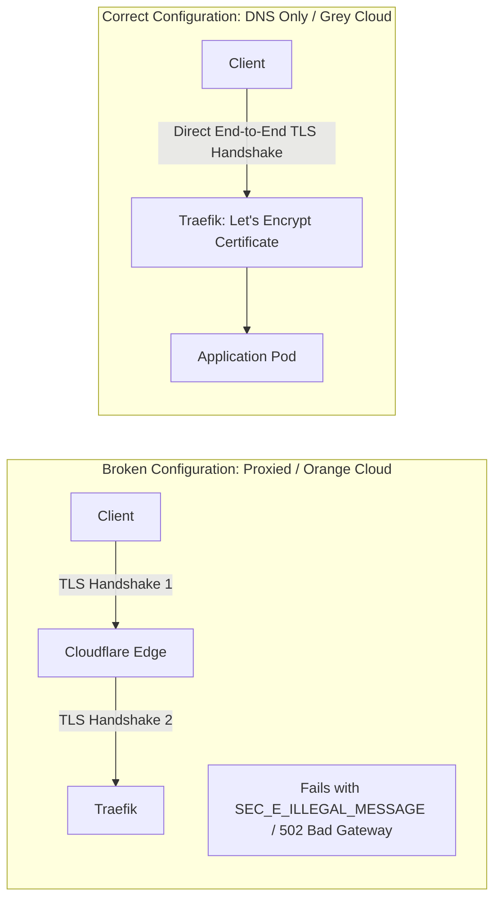

# DNS & TLS Automation Architecture

## Overview

The cluster leverages an automated, zero-touch certificate and DNS provisioning pipeline. Combining **external-dns** and **cert-manager** allows any newly declared Kubernetes `Ingress` resource to immediately trigger:

1. DNS record synchronization (`A` and `TXT` ownership tracking) on Cloudflare.
2. Automated issuance and renewal of valid TLS certificates from Let's Encrypt using the ACME `DNS-01` challenge mechanism.

---

## Architecture Pipeline



---

## External-DNS Implementation

`external-dns` continuously reconciles Kubernetes Ingress resources with Cloudflare DNS records.

### Operational Parameters

* **Provider:** `cloudflare`
* **Target Filter:** Domain filter restricted to `baptiste.zip`.
* **Record Strategy:** Creates an `A` record pointing to the public gateway IP alongside a companion `TXT` record.
* **TXT Registry Identifier:** `heritage=external-dns,external-dns/owner=k3s-cloudflare-homelab`. This prevents accidental modification or deletion of records managed outside Kubernetes.

### Manifest Annotation Requirements

To ensure external-dns discovers the Ingress and assigns the correct public IP (rather than the local private cluster node IP), each Ingress manifest must define:

```yaml
metadata:
  annotations:
    external-dns.alpha.kubernetes.io/target: 82.67.198.156
```

---

## Cloudflare Operational Rule: Proxy Status (Grey Cloud)



### Rule Invariant
All hostnames routed to this cluster (`*.baptiste.zip`) **must remain in DNS Only (Grey Cloud)** mode in Cloudflare.

### Technical Justification
1. **End-to-End TLS Termination:** Traefik natively terminates TLS using dedicated Let's Encrypt certificates issued to the cluster.
2. **ACME Challenge Integrity:** Cloudflare edge caching and proxying interfere with dynamic header negotiation and challenge propagation.
3. **Record Ownership Synchronization:** When a record is set to Orange Cloud, Cloudflare dynamically masks the origin IP with Anycast edge IPs, causing continuous reconciliation drift and ownership conflicts in `external-dns`.

---

## Cert-Manager & Let's Encrypt Architecture

Cert-manager handles certificate lifecycle automation using ACME `DNS-01` validation against the Cloudflare API.

### Advantage of DNS-01 over HTTP-01
* Eliminates the need to open port `80` to public validation traffic for challenge verification.
* Enables wildcard certificate support (`*.baptiste.zip`) if required.
* Functions seamlessly regardless of firewall, port-forwarding, or NAT state.

### ClusterIssuer Definition (`letsencrypt-prod`)

The global issuer configured in the cluster is structured as follows:

```yaml
apiVersion: cert-manager.io/v1
kind: ClusterIssuer
metadata:
  name: letsencrypt-prod
spec:
  acme:
    server: [https://acme-v02.api.letsencrypt.org/directory](https://acme-v02.api.letsencrypt.org/directory)
    email: admin@baptiste.zip
    privateKeySecretRef:
      name: letsencrypt-prod-account-key
    solvers:
    - dns01:
        cloudflare:
          apiTokenSecretRef:
            name: cloudflare-api-token-secret
            key: api-token
```

### Ingress Manifest Integration

Linking an Ingress to the automated certificate pipeline requires two configuration blocks:

```yaml
metadata:
  annotations:
    cert-manager.io/cluster-issuer: letsencrypt-prod
spec:
  tls:
  - hosts:
    - app.baptiste.zip
    secretName: app-baptiste-zip-tls
```

* When applied, `cert-manager` detects the annotation and creates:
  1. A `Certificate` custom resource named after the Secret.
  2. A `CertificateRequest`.
  3. An `Order` and an associated `Challenge`.
* Upon successful validation, the certificate chain and private key are written to the target Secret `app-baptiste-zip-tls`, which Traefik mounts directly for TLS handshakes.

---

## Verification & Diagnostics Runbook

### 1. Verify External-DNS Operation

View the controller synchronization logs:

```bash
kubectl logs -n kube-system -l app.kubernetes.io/name=external-dns --tail=50
```

Verify that the target record exists with the proper TXT registry tag:

```bash
dig +short A app.baptiste.zip
dig +short TXT app.baptiste.zip
```

Expected TXT output:
```text
"heritage=external-dns,external-dns/owner=k3s-cloudflare-homelab"
```

### 2. Verify Certificate Status

Check the overall status of all issued certificates in the namespace:

```bash
kubectl get certificate -n default
```

Expected output:
```text
NAME                     READY   SECRET                   AGE
app-baptiste-zip-tls     True    app-baptiste-zip-tls     5m
```

### 3. Diagnose Certificate Issuance Failures

If `READY` remains `False`, inspect the sub-resources in hierarchical order:

```bash
# Step 1: Check the Certificate resource status
kubectl describe certificate app-baptiste-zip-tls -n default

# Step 2: Check the active ACME challenges
kubectl get challenge -n default
kubectl describe challenge -n default

# Step 3: Inspect cert-manager controller logs
kubectl logs -n cert-manager -l app=cert-manager --tail=100
```
