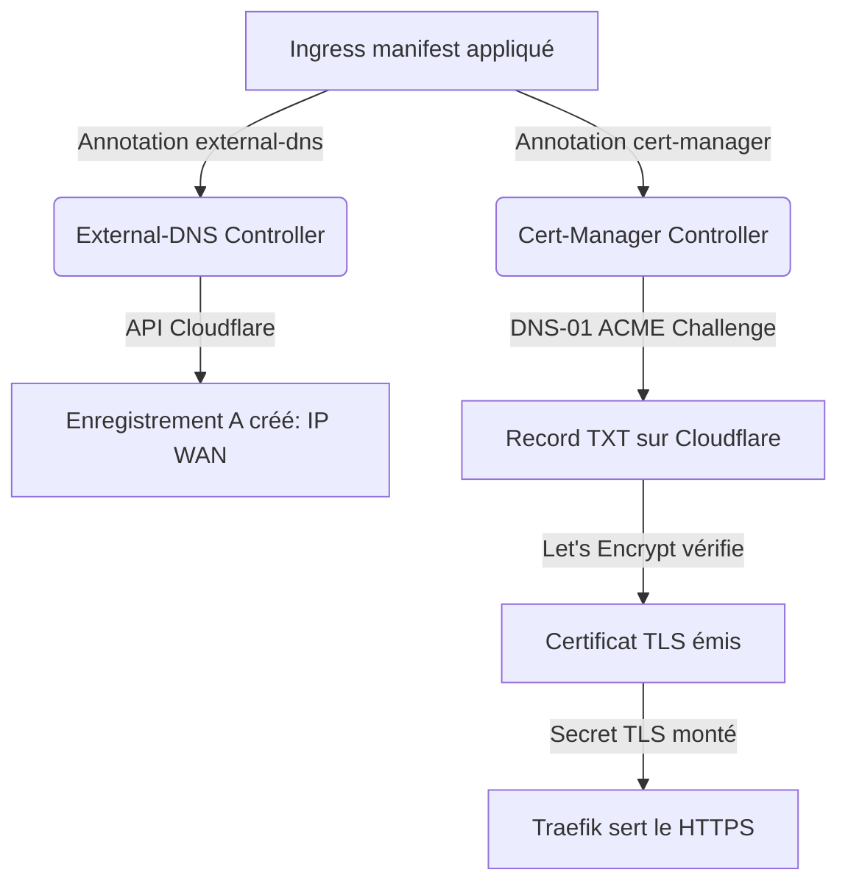

# Automatisation DNS & TLS

Toute exposition d'un nouveau service public repose sur une chaîne 100% automatisée sans intervention manuelle sur Cloudflare ni génération manuelle de certificats.

## Règles impératives Cloudflare

1. **Désactiver le Proxy Cloudflare (Nuage Gris / DNS Only)** :  
   Pour les sous-domaines routés vers Traefik (`api.scrabble`, `scrabble`, `admin.scrabble`, `argo`, etc.), le proxy Cloudflare **doit impérativement être désactivé**. Traefik gère lui-même la terminaison TLS via son certificat Let's Encrypt. Laisser le nuage orange provoque des erreurs de handshake `SEC_E_ILLEGAL_MESSAGE` ou des erreurs 502.
2. **Gestion du propriétaire TXT** :  
   `external-dns` crée des enregistrements TXT (`k3s-cloudflare-homelab`) associés à chaque sous-domaine pour suivre le cycle de vie de la ressource Kubernetes. Si un domaine existait déjà sur Cloudflare avant Kubernetes, il faut supprimer son ancien enregistrement `A` manuel pour qu'external-dns en prenne possession.