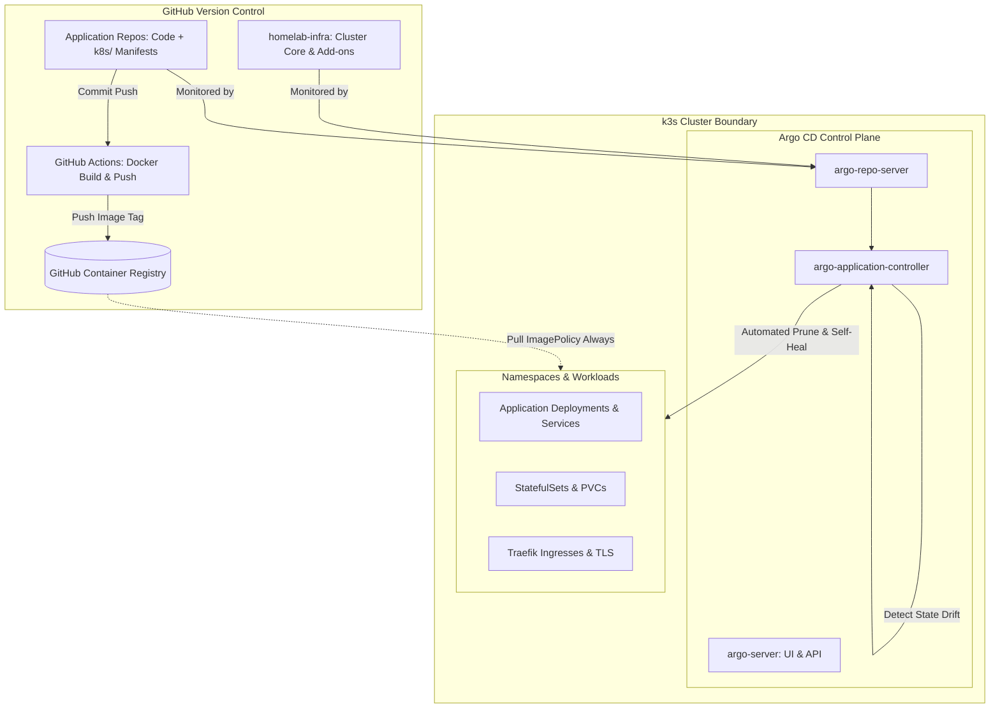

# GitOps & Continuous Delivery Architecture

## Overview

The cluster operates strictly on **GitOps** principles powered by **Argo CD**. All infrastructure definitions, add-ons, and application manifests reside in version-controlled Git repositories. Argo CD continuously monitors these repositories, tracks drift between declared Git states and live cluster states, and automates reconciliation without manual cluster intervention.

---

## GitOps Reconciliation Workflow



---

## Argo CD Project Partitioning (`AppProject`)

Argo CD uses **AppProject** custom resources to isolate applications, enforce deployment destinations, and control accessible Git source repositories.

### Baseline Projects in Use

| Project Name | Scope & Purpose | Permitted Source Repositories | Permitted Destinations |
| :--- | :--- | :--- | :--- |
| `default` | Core infrastructure and bootstrap manifests | `*` (Any repository) | Cluster: `*`, Namespaces: `*` |
| `scrabble` | Dedicated game stack isolation | `https://github.com/ZiplEix/scrabble.git` | Cluster: `in-cluster`, Namespace: `default` |

### Defining an AppProject Resource

When creating dedicated project boundaries, the project must explicitly allow the target Git repository URL and Kubernetes server/namespace destinations.

```yaml
apiVersion: argoproj.io/v1alpha1
kind: AppProject
metadata:
  name: scrabble
  namespace: argocd
spec:
  description: Scrabble application ecosystem and services
  sourceRepos:
  - [https://github.com/ZiplEix/scrabble.git](https://github.com/ZiplEix/scrabble.git)
  destinations:
  - namespace: default
    server: [https://kubernetes.default.svc](https://kubernetes.default.svc)
  clusterResourceWhitelist:
  - group: ''
    kind: Namespace
```

---

## Application Topologies: Monorepo vs Microservices

To avoid cluttering the control plane with hundreds of discrete Argo CD applications, two primary deployment topologies are supported.

### Topology 1: Recursive Monolithic Tree (Preferred for Multi-Component Apps)

When a single application consists of several interdependent tiers (e.g., PostgreSQL StatefulSet, Go API, and two SvelteKit frontends), the entire ecosystem is managed as a single Argo CD `Application` using **recursive directory scanning**.

```text
scrabble (Git Repo)
└── k8s/
    ├── postgres/
    │   ├── postgres.yaml
    │   └── sealed-secret.yaml
    ├── api/
    │   ├── app.yaml
    │   └── sealed-secret.yaml
    ├── frontend/
    │   └── app.yaml
    └── admin/
        └── app.yaml
```

#### Application Manifest with Directory Recurse

```yaml
apiVersion: argoproj.io/v1alpha1
kind: Application
metadata:
  name: scrabble
  namespace: argocd
  finalizers:
  - resources-finalizer.argocd.argoproj.io
spec:
  project: scrabble
  source:
    repoURL: [https://github.com/ZiplEix/scrabble.git](https://github.com/ZiplEix/scrabble.git)
    targetRevision: HEAD
    path: k8s
    directory:
      recurse: true
  destination:
    server: [https://kubernetes.default.svc](https://kubernetes.default.svc)
    namespace: default
  syncPolicy:
    automated:
      prune: true
      selfHeal: true
    syncOptions:
    - CreateNamespace=false
```

* **`directory.recurse: true`**: Instructs Argo CD to traverse all subdirectories (`k8s/postgres`, `k8s/api`, etc.) and assemble them into a unified resource tree.
* **`resources-finalizer`**: Deleting the Application resource in Argo CD automatically removes all cascaded Kubernetes objects in the cluster.

---

### Topology 2: Discrete Application per Repository

For standalone services (e.g., utility bots, independent microservices), an Application points directly to the `k8s/` folder of that service repository.

```yaml
apiVersion: argoproj.io/v1alpha1
kind: Application
metadata:
  name: independent-service
  namespace: argocd
spec:
  project: default
  source:
    repoURL: [https://github.com/ZiplEix/independent-service.git](https://github.com/ZiplEix/independent-service.git)
    targetRevision: HEAD
    path: k8s
  destination:
    server: [https://kubernetes.default.svc](https://kubernetes.default.svc)
    namespace: default
  syncPolicy:
    automated:
      prune: true
      selfHeal: true
```

---

## Automated Sync Policies & Drift Remediation

All production applications run with an active automated reconciliation engine.

### Automated Capabilities

1. **Self-Healing (`selfHeal: true`):**  
   If an administrator modifies a live cluster resource manually (e.g., running `kubectl edit` or scaling a deployment via the CLI), Argo CD detects the configuration drift and immediately overwrites the live state with the canonical configuration defined in Git.
2. **Resource Pruning (`prune: true`):**  
   When a manifest file or object is deleted from the Git repository, Argo CD automatically prunes and deletes the corresponding object from the cluster, preventing orphaned workloads.

---

## Declarative App-of-Apps Pattern

Instead of declaring applications manually through the web UI, cluster applications can be bootstrapped declaratively via the `homelab-infra` repository using the **App-of-Apps** pattern.

```text
homelab-infra/
└── manifests/
    └── apps/
        ├── scrabble.yaml
        ├── secret-app.yaml
        └── monitoring.yaml
```

A root application deployed into Argo CD tracks `manifests/apps/` and continuously reconciles the set of child applications deployed across the cluster.

---

## Operational Runbook & Diagnostics

### 1. Inspect Application Sync and Health Status
Check the reconciliation status of all applications via `kubectl`:

```bash
kubectl get applications -n argocd
```

Expected output:
```text
NAME       SYNC STATUS   HEALTH STATUS
scrabble   Synced        Healthy
```

### 2. Force Immediate Manual Sync
Trigger an immediate reconciliation loop without waiting for the default polling interval (3 minutes):

```bash
kubectl annotate application -n argocd scrabble argocd.argoproj.io/refresh=hard --overwrite
```

### 3. Troubleshoot Sync Failures
If an application is in `Degraded` or `OutOfSync` state:

```bash
kubectl describe application -n argocd scrabble
```

Look at the `Status.Conditions` and `Status.OperationState.SyncResult` sections for validation errors, unpermitted repository messages, or schema mismatches.
