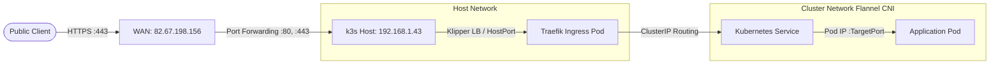

# Networking & Ingress Architecture

## Overview

The cluster networking layer is built upon the default k3s networking stack, using **Kine/Flannel** for Container Network Interface (CNI) pod-to-pod communication and **Traefik v3** as the integrated Ingress Controller. 

All external traffic originating from the public Internet reaches the cluster through a single static public IP, is forwarded by the edge router, and terminates at Traefik for TLS termination and Layer 7 HTTP routing.

---

## Packet Flow & Edge Routing



### 1. External Ingress Boundary

 - Public Gateway: Traffic hits the ISP router at ``82.67.198.156``.
 - NAT / Port Forwarding Rules:
   - External port 80/TCP forwards to ``192.168.1.43:80``.
   - External port 443/TCP forwards to ``192.168.1.43:443``.
 - Service Load Balancer: k3s runs ``klipper-lb`` (ServiceLB) by default, binding the host interfaces ``0.0.0.0:80`` and ``0.0.0.0:443`` directly to Traefik's daemon pods.

## Ingress Controller Configuration (Traefik)

Traefik is deployed within the ``kube-system`` namespace and exposes two primary entrypoints:

Entrypoint Name | Port | Protocol | Purpose
|---|---|---|---|
| ``web`` | ``80`` | HTTP | ACME HTTP-01 challenges and automated HTTPS redirects |
| ``websecure`` | ``443`` | HTTPS | Secure TLS traffic termination |

### Ingress Annotations Standard

To correctly register an Ingress resource with Traefik, cert-manager, and external-dns, the following annotations must be explicitly specified:

```yaml
metadata:
  annotations:
    # Forces routing through the secure HTTPS entrypoint
    traefik.ingress.kubernetes.io/router.entrypoints: websecure
    # Instructs Traefik to negotiate TLS
    traefik.ingress.kubernetes.io/router.tls: "true"
    # Links cert-manager for automatic TLS certificate generation
    cert-manager.io/cluster-issuer: letsencrypt-prod
    # Overrides target IP for external-dns (matches public WAN)
    external-dns.alpha.kubernetes.io/target: 82.67.198.156
```

## Ingress Resource Specifications

A standard Kubernetes Ingress defines host-based routing rules and associates them with a TLS Secret managed by cert-manager.

### Reference Ingress Manifest

```yaml
apiVersion: networking.k8s.io/v1
kind: Ingress
metadata:
  name: example-service-ingress
  namespace: default
  annotations:
    cert-manager.io/cluster-issuer: letsencrypt-prod
    traefik.ingress.kubernetes.io/router.entrypoints: websecure
    traefik.ingress.kubernetes.io/router.tls: "true"
    external-dns.alpha.kubernetes.io/target: 82.67.198.156
spec:
  ingressClassName: traefik
  rules:
  - host: service.baptiste.zip
    http:
      paths:
      - path: /
        pathType: Prefix
        backend:
          service:
            name: example-service-svc
            port:
              number: 8080
  tls:
  - hosts:
    - service.baptiste.zip
    secretName: service-baptiste-zip-tls
```

### Ingress Specifications Breakdown

 - ``spec.ingressClassName``: Must be explicitly set to ``traefik``.
 - ``spec.rules.host``: Fully Qualified Domain Name (FQDN) matching the service route.
 - ``spec.rules.http.paths``:
   - ``pathType: Prefix`` matches the base URL and all child paths.
   - ``backend.service.name``: Target ClusterIP or Headless Service name.
   - ``backend.service.port.number``: Must match the service port defined in spec.ports[].port.
 - ``spec.tls``:
   - ``hosts``: Target hostname requested for the TLS handshake (SNI).
   - ``secretName``: Target Kubernetes ``Secret`` where cert-manager writes the signed certificate (``tls.crt`` and ``tls.key``).

## Cluster Internal Networking (East-West Traffic)

Internal cluster services communicate directly using CoreDNS without traversing Traefik or the public gateway.

### CoreDNS Resolution Scheme

Any service inside the cluster can resolve another service using the Fully Qualified Service Domain Name:

$$\text{service-name}.\text{namespace}.\text{svc}.\text{cluster}.\text{local}$$

### Example: Internal Database Resolution

The backend Go API communicates with PostgreSQL directly across the private Flannel network:

 - Target Service: ``scrabble-postgres-svc``
 - Target Namespace: ``default``
 - Resolved Hostname: ``scrabble-postgres-svc.default.svc.cluster.local``
 - Default Port: ``5432``

This prevents exposing database ports to the host network or public routing tables, enforcing strict network isolation.

## Troubleshooting & Verification Runbook

### 1. Verify Ingress Status

Inspect whether the Ingress object has received an IP address from the controller:

```bash
kubectl get ingress -n default
```

Expected output:

```bash
NAME                       CLASS     HOSTS                      ADDRESS         PORTS     AGE
example-service-ingress    traefik   service.baptiste.zip       192.168.1.43    80, 443   12m
```

### 2. Trace Traefik Routing Logs

Stream runtime proxy logs from the Traefik pods in ``kube-system``:

```bash
kubectl logs -n kube-system -l app.kubernetes.io/name=traefik --tail=100 -f
```

### 3. Check Traefik Service Endpoints

Ensure that Traefik successfully discovers the target backend pod:

```bash
kubectl get endpoints example-service-svc -n default
```

Expected output shows the IP address of the target application pod (e.g., ``10.42.0.x:8080``). If the ``ENDPOINTS`` column is ``<none>``, verify that the Service ``spec.selector`` matches the Pod labels.
