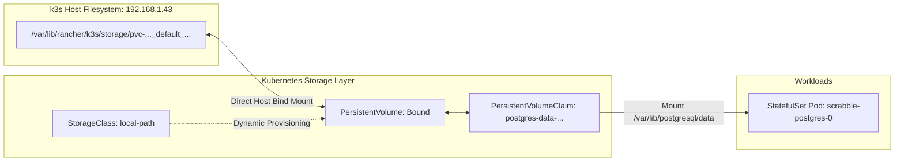

# Stateful Workloads & Database Maintenance Guide

## Overview

Stateful workloads such as relational databases require persistent disk storage, strict network isolation, and well-defined backup and restore procedures. This cluster deploys databases using Kubernetes **StatefulSet** primitives backed by the native k3s **Local-Path Provisioner** (`local-path` StorageClass).

---

## Storage Architecture & Lifecycle



### Local-Path Provisioner Properties
* **Provisioner:** `rancher.io/local-path`
* **Volume Binding Mode:** `WaitForFirstConsumer` (allocates host disk path only when the Pod is scheduled onto a node).
* **Storage Location on Host:** Stored on the host filesystem under `/var/lib/rancher/k3s/storage/`.
* **Reclaim Policy:** `Delete` by default. When a `PersistentVolumeClaim` (PVC) is deleted, the underlying host directory is purged.

---

## Database Security & Network Isolation Invariants

1. **No External Exposure (Ingress Forbidden):**  
   Database pods must **never** be mapped to an Ingress or exposed via NodePort/LoadBalancer.
2. **Cluster-Internal Routing:**  
   Applications reach the database strictly using the cluster DNS endpoint:
   ```text
   <service-name>.<namespace>.svc.cluster.local:<port>
   ```
3. **Dedicated Headless/ClusterIP Service:**  
   StatefulSets bind to a dedicated internal Service ensuring persistent DNS addressing.

---

## Reference PostgreSQL StatefulSet Architecture

A standard production database manifest couples the `StatefulSet` with dynamic `volumeClaimTemplates`:

```yaml
apiVersion: apps/v1
kind: StatefulSet
metadata:
  name: scrabble-postgres
  namespace: default
spec:
  serviceName: scrabble-postgres-svc
  replicas: 1
  selector:
    matchLabels:
      app: scrabble-postgres
  template:
    metadata:
      labels:
        app: scrabble-postgres
    spec:
      containers:
      - name: postgres
        image: postgres:17-alpine
        ports:
        - containerPort: 5432
          name: postgres
        envFrom:
        - secretRef:
            name: scrabble-postgres-secrets
        volumeMounts:
        - name: postgres-data
          mountPath: /var/lib/postgresql/data
  volumeClaimTemplates:
  - metadata:
      name: postgres-data
    spec:
      accessModes: [ "ReadWriteOnce" ]
      storageClassName: "local-path"
      resources:
        requests:
          storage: 10Gi
---
apiVersion: v1
kind: Service
metadata:
  name: scrabble-postgres-svc
  namespace: default
spec:
  type: ClusterIP
  ports:
  - port: 5432
    targetPort: 5432
    name: postgres
  selector:
    app: scrabble-postgres
```

---

## Database Dump & Backup Runbook

All database backups should be performed directly from the k3s host or an administrative node with network access.

### 1. Execute Remote Compressed Dump
To dump an active PostgreSQL database running in the cluster or an external machine:

```bash
# Dump from an external host (e.g. legacy server 192.168.1.20)
pg_dump -h 192.168.1.20 -p 5454 -U postgres -d postgres -F c -b -v -f /tmp/backup_$(date +%Y%m%d_%H%M%S).dump

# Dump directly from an active in-cluster pod
kubectl exec -i scrabble-postgres-0 -n default -- pg_dump -U postgres -d postgres -F c -b -v > /tmp/backup_k3s_$(date +%Y%m%d_%H%M%S).dump
```

* **`-F c`**: Custom format (compressed binary, required by `pg_restore`).
* **`-b`**: Includes large objects (blobs).
* **`-v`**: Verbose mode.

---

## Database Restore & Disaster Recovery Runbook

### 1. In-Cluster Restore via `pg_restore`
To restore a binary dump into the in-cluster PostgreSQL pod:

```bash
kubectl exec -i scrabble-postgres-0 -n default -- pg_restore -U postgres -d postgres -v < /tmp/backup_prod.dump
```

### 2. Handling Version Incompatibilities (e.g., PostgreSQL 16 to 17)

If the target PostgreSQL server version rejects a previously initialized volume (`FATAL: database files are incompatible with server`):

```bash
# 1. Delete the StatefulSet to stop active locks
kubectl delete statefulset scrabble-postgres -n default

# 2. Delete the stale PVC (WARNING: Purges local disk volume)
kubectl delete pvc postgres-data-scrabble-postgres-0 -n default

# 3. Argo CD will automatically recreate the StatefulSet and provision a clean PVC
kubectl rollout status statefulset/scrabble-postgres -n default

# 4. Stream the backup into the freshly initialized engine
kubectl exec -i scrabble-postgres-0 -n default -- pg_restore -U postgres -d postgres -v < /tmp/backup_prod.dump
```

---

## Interactive Administrative Shell (`psql`)

### Option A: Interactive In-Container Shell
Open a terminal session directly inside the database pod:

```bash
kubectl exec -it scrabble-postgres-0 -n default -- psql -U postgres -d postgres
```

Useful database administration queries:
```sql
-- List tables and row counts
\dt
SELECT table_name FROM information_schema.tables WHERE table_schema = 'public';

-- Check active client connections
SELECT pid, usename, client_addr, application_name, state FROM pg_stat_activity;

-- Verify database sizing
SELECT pg_size_pretty(pg_database_size('postgres'));
```

### Option B: Local Workstation Access via Port-Forwarding
To inspect the database using local GUI tools (e.g., DBeaver, DataGrip) without public network exposure:

```bash
kubectl port-forward statefulset/scrabble-postgres 5433:5432 -n default
```
* Connect client tool to: `localhost:5433`
* Credentials: User and password defined in the active `SealedSecret`.
