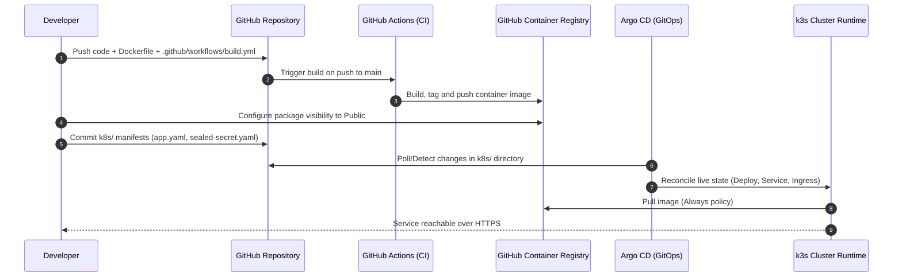

# Service Onboarding Guide

## Overview

This guide details the complete, end-to-end operational procedure for onboarding a new application service onto the k3s cluster. The process establishes:

1. Continuous delivery via GitHub Actions and GitHub Container Registry (GHCR).
2. Declarative Kubernetes manifests (`Deployment`, `Service`, `Ingress`, and optional `SealedSecret`).
3. Automated public routing, DNS record synchronization via Cloudflare, and TLS certificate generation.
4. GitOps continuous reconciliation using Argo CD.

---

## Onboarding Sequence



---

!!! tip "Accelerate Onboarding with Repository Templates"
    Instead of manually structuring files and CI configurations, initialize your repository using one of the following production-ready templates:
    
    * **Backend (Go):** [`ZiplEix/template-go-service`](https://github.com/ZiplEix/template-go-service)
    * **Frontend (SvelteKit / Bun):** [`ZiplEix/template-sveltekit-app`](https://github.com/ZiplEix/template-sveltekit-app)
    
    Both templates include pre-configured `.github/workflows/build.yml` targeting GHCR, multi-stage Dockerfiles, and baseline `k8s/` resources.

## Step 1: Containerization & Registry Automation

Every service must build and publish an OCI-compliant container image to GitHub Container Registry (`ghcr.io`).

### 1. Repository Workflow Specification
Create `.github/workflows/build.yml` in your application repository:

```yaml
name: Build and Push OCI Image

on:
  push:
    branches: [ "main" ]
    paths-ignore:
      - 'README.md'
      - 'docs/**'

env:
  REGISTRY: ghcr.io
  IMAGE_NAME: ${{ github.repository }}

jobs:
  build-and-push:
    runs-on: ubuntu-latest
    permissions:
      contents: read
      packages: write

    steps:
      - name: Checkout repository
        uses: actions/checkout@v4

      - name: Log in to GHCR
        uses: docker/login-action@v3
        with:
          registry: ${{ env.REGISTRY }}
          username: ${{ github.actor }}
          password: ${{ secrets.GITHUB_TOKEN }}

      - name: Extract metadata (tags, labels)
        id: meta
        uses: docker/metadata-action@v5
        with:
          images: ${{ env.REGISTRY }}/${{ env.IMAGE_NAME }}
          tags: |
            type=raw,value=latest
            type=sha,format=short

      - name: Build and push Docker image
        uses: docker/build-push-action@v5
        with:
          context: .
          file: ./Dockerfile
          push: true
          tags: ${{ steps.meta.outputs.tags }}
          labels: ${{ steps.meta.outputs.labels }}
```

### 2. GHCR Access Configuration
By default, GitHub sets newly created container packages to **Private**.
To allow k3s nodes to pull images without requiring image pull secrets:
1. Navigate to your GitHub profile or organization.
2. Select **Packages** and click the relevant container repository.
3. Open **Package settings** in the sidebar.
4. Scroll to **Danger Zone** > **Change visibility** and select **Public**.

---

## Step 2: Secret Sealing (Conditional)

If your workload requires sensitive environment variables (API credentials, signing keys, connection strings):

1. Generate the encrypted `SealedSecret` manifest locally:
```bash
kubectl create secret generic my-service-secrets \
  --namespace default \
  --from-literal=API_KEY="production-secret-token" \
  --from-literal=DB_PASSWORD="change-me" \
  --dry-run=client -o yaml | \
  kubeseal --controller-name=sealed-secrets --controller-namespace=kube-system --format=yaml > k8s/sealed-secret.yaml
```

2. Store the resulting `k8s/sealed-secret.yaml` directly in version control.

---

## Step 3: Kubernetes Deployment, Service & Ingress Manifests

Create the unified manifest file `k8s/app.yaml`:

```yaml
apiVersion: apps/v1
kind: Deployment
metadata:
  name: my-service
  namespace: default
  labels:
    app: my-service
spec:
  replicas: 1
  selector:
    matchLabels:
      app: my-service
  template:
    metadata:
      labels:
        app: my-service
    spec:
      containers:
      - name: web
        image: ghcr.io/zipleix/my-service:latest
        imagePullPolicy: Always
        ports:
        - containerPort: 8080
          name: http
        env:
        - name: PORT
          value: "8080"
        - name: NODE_ENV
          value: "production"
        # Uncomment if secrets are sealed:
        # envFrom:
        # - secretRef:
        #     name: my-service-secrets
---
apiVersion: v1
kind: Service
metadata:
  name: my-service-svc
  namespace: default
  labels:
    app: my-service
spec:
  type: ClusterIP
  ports:
  - port: 8080
    targetPort: 8080
    name: http
  selector:
    app: my-service
---
apiVersion: networking.k8s.io/v1
kind: Ingress
metadata:
  name: my-service-ingress
  namespace: default
  annotations:
    cert-manager.io/cluster-issuer: letsencrypt-prod
    traefik.ingress.kubernetes.io/router.entrypoints: websecure
    traefik.ingress.kubernetes.io/router.tls: "true"
    external-dns.alpha.kubernetes.io/target: 82.67.198.156
spec:
  ingressClassName: traefik
  rules:
  - host: my-service.baptiste.zip
    http:
      paths:
      - path: /
        pathType: Prefix
        backend:
          service:
            name: my-service-svc
            port:
              number: 8080
  tls:
  - hosts:
    - my-service.baptiste.zip
    secretName: my-service-baptiste-zip-tls
```

---

## Step 4: Cloudflare Verification

Before Argo CD synchronizes the application:

1. Open the Cloudflare DNS dashboard for `baptiste.zip`.
2. Check if a pre-existing record exists for `my-service.baptiste.zip`:
   * **If present as an A or CNAME record:** Delete it to prevent conflicts with `external-dns`.
   * **Proxy Status Check:** Verify that no proxy is active. Once created, the record must strictly display **DNS only (Grey Cloud)**.

---

## Step 5: Argo CD Registration

### Option A: Via Argo CD Web UI
1. Navigate to `https://argo.baptiste.zip`.
2. Click **+ NEW APP** in the top navigation bar.
3. Configure the application spec:
   * **Application Name:** `my-service`
   * **Project Name:** `default`
   * **Sync Policy:** `Automatic`, enable `Prune Resources` and `Self-Heal`.
   * **Repository URL:** `https://github.com/ZiplEix/my-service.git`
   * **Revision:** `HEAD` (or `main`)
   * **Path:** `k8s` (Enable `Directory Recurse` if nested directories are used).
   * **Cluster URL:** `https://kubernetes.default.svc`
   * **Namespace:** `default`
4. Click **CREATE**.

### Option B: Declarative Application Manifest (GitOps App-of-Apps)
Add the application manifest to `homelab-infra/manifests/apps/my-service.yaml`:

```yaml
apiVersion: argoproj.io/v1alpha1
kind: Application
metadata:
  name: my-service
  namespace: argocd
  finalizers:
  - resources-finalizer.argocd.argoproj.io
spec:
  project: default
  source:
    repoURL: [https://github.com/ZiplEix/my-service.git](https://github.com/ZiplEix/my-service.git)
    targetRevision: HEAD
    path: k8s
  destination:
    server: [https://kubernetes.default.svc](https://kubernetes.default.svc)
    namespace: default
  syncPolicy:
    automated:
      prune: true
      selfHeal: true
```

---

## Step 6: Post-Deployment Verification Runbook

Execute this verification sequence from the k3s node or remote admin shell:

```bash
# 1. Verify Deployment rollout
kubectl rollout status deployment/my-service -n default

# 2. Verify External-DNS created the A record
dig +short A my-service.baptiste.zip @1.1.1.1

# 3. Verify Certificate status
kubectl get certificate my-service-baptiste-zip-tls -n default

# 4. Perform public HTTPS probe
curl -I [https://my-service.baptiste.zip](https://my-service.baptiste.zip)
```

Expected HTTP Probe Output:
```text
HTTP/2 200
date: Thu, 10 Sep 2026 21:00:00 GMT
content-type: text/html; charset=utf-8
```
