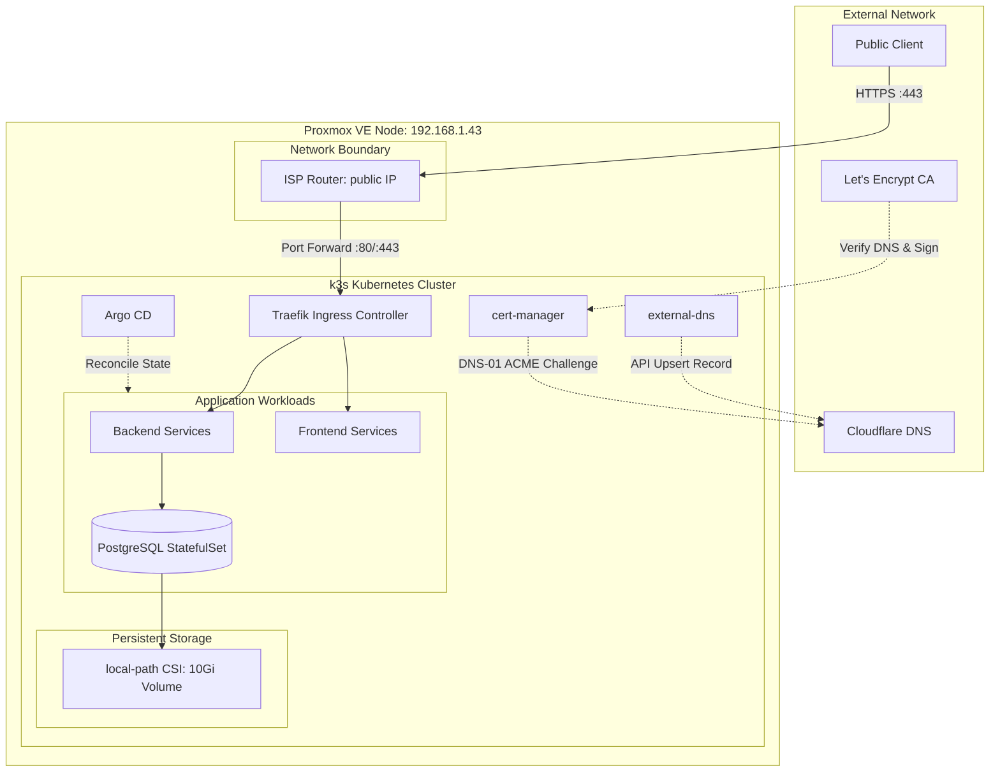

# Homelab k3s GitOps Infrastructure Documentation

## Overview

This repository hosts the declarative configuration and operational documentation for a single-node **k3s** Kubernetes homelab cluster. The entire system is managed through **GitOps** using **Argo CD**, with automated certificate issuance via **cert-manager** (Let's Encrypt DNS-01 challenge), dynamic DNS synchronization with **external-dns** on Cloudflare, and secret management using Bitnami **Sealed Secrets**.

---

## High-Level Architecture

The infrastructure runs on a dedicated Debian virtual machine hosted on Proxmox VE. Public traffic enters through the ISP gateway, redirects to the node via port forwarding, and is routed by the Traefik Ingress Controller directly to application workloads.

## Core System Specifications

### Infrastructure Baseline

|Component | Specification / Version | Role |
|---|---|---|
| Hypervisor | Proxmox VE | Virtualization host |
| Virtual Machine | Debian GNU/Linux (k3s-node) | Primary Kubernetes host (192.168.1.43) |
| Kubernetes Engine | k3s v1.30+ | Lightweight production-ready Kubernetes distribution |
| Storage Provisioner | rancher.io/local-path | Persistent host disk mounting for stateful workloads |
| Edge IP (WAN) | 82.67.198.156 | Static public ingress endpoint |

### Cluster Add-ons & Control Plane

| Subsystem | Component | Operational Responsibility |
|---|---|---|
| Subsystem | Component | Operational Responsibility |
| Ingress Controller | Traefik | "Reverse proxy |  dynamic TLS termination |  path routing" |
| DNS Controller | external-dns (v0.14.0+) | Synchronizes Ingress hosts to Cloudflare A/TXT records |
| Certificate Manager | cert-manager | ACME automation via Cloudflare DNS-01 provider |
| GitOps Operator | Argo CD | Tracks Git state and enforces continuous deployment |
| Secret Operator | Sealed Secrets (Bitnami) | Asymmetric encryption of secrets committed into Git |

### Core Operational Invariants

Every production workload deployed on this cluster must strictly adhere to the following invariants:

1. Pure GitOps Delivery:
    
    Manual application of manifests via kubectl apply on production workloads is strictly prohibited during normal operations. All cluster states must originate from tracked Git repositories synchronized by Argo CD.

2. Cloudflare DNS Only (No Proxy):

    All DNS A records mapped to cluster Ingress endpoints (*.baptiste.zip) must operate in DNS-only mode (Grey Cloud) in Cloudflare. Proxied mode (Orange Cloud) terminates TLS at Cloudflare's edge and breaks end-to-end TLS negotiation, cert-manager ACME renewals, and Traefik routing.

3. Mandatory Asymmetric Secret Encryption:

    No plaintext Kubernetes Secret resources may ever be committed to version control. All credentials, tokens, and database passwords must be compiled into SealedSecret resources prior to commit.

4. Internal Database Isolation:

    Stateful database workloads (e.g., PostgreSQL) are deployed as StatefulSet resources connected to headless or ClusterIP services. Databases must never be bound to an Ingress or exposed outside the Kubernetes cluster network.

## Starter Templates

Pre-configured GitHub repository templates are maintained to streamline new service onboarding. These boilerplates include containerization manifests, standard GitHub Actions CI pipelines targeting GHCR, and pre-formatted `k8s/` manifests:

* **Go Microservice Template:** [`github.com/ZiplEix/template-go-service`](https://github.com/ZiplEix/template-go-service) — Lightweight containerized Go HTTP service (Echo/Chi) with multi-stage Docker build, health checks, and baseline Kubernetes manifests.
* **SvelteKit Application Template:** [`github.com/ZiplEix/template-sveltekit-app`](https://github.com/ZiplEix/template-sveltekit-app) — SvelteKit + Bun production setup pre-configured for dynamic/static runtime environment variables and ingress routing.

## Documentation Structure

* **Architecture:**
  * [Networking & Ingress](architecture/networking.md): Traefik entrypoints, routing rules, and header overrides.
  * [DNS & TLS Automation](architecture/dns-tls.md): External-DNS reconciliation and Let's Encrypt DNS-01 validation.
  * [GitOps & Delivery](architecture/gitops.md): Argo CD project partitioning, application topologies, and self-healing.
* **Operational Guides:**
  * [Secret Encryption Runbook](guides/secrets.md): Encrypting simple and multiline variables with `kubeseal`.
  * [Service Onboarding Guide](guides/new-service.md): End-to-end setup of a new workload from repository to public routing.
  * [Stateful Workloads & Backups](guides/database.md): Local-path storage volumes, dump, restore, and maintenance.
* **Manifest Reference:**
  * [Standard Application Manifest](manifests/standard-app.md): Baseline YAML template for Deployment, Service, and Ingress.
  * [StatefulSet Manifest](manifests/database-app.md): Baseline YAML template for persistent database deployments.
